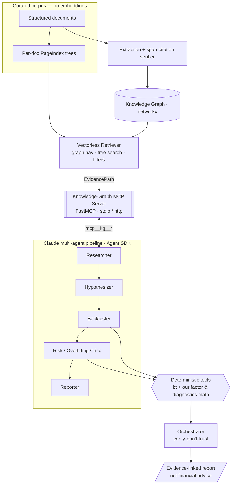

# FactorForge

**An auditable, vectorless, evidence-first quant-research engine.** It turns curated quant-finance
documents into an evidence-linked **knowledge graph**, retrieves over it **without any vector DB or
embeddings** (every result is a *traceable path*, not a similarity score), exposes that knowledge to
a **Claude multi-agent pipeline via a standalone MCP server**, and has the agents research →
hypothesize → **backtest** → critique overfitting → report — with every fact carrying a span-level
citation and every number coming from deterministic, unit-tested tools.

> ⚠️ **Research/educational use only. Not financial advice.** No claim of real alpha is made or
> implied. Backtests use synthetic or historical *sample* data and are illustrative. The
> **engineering and methodology** are the point — not returns.

---

## Why it's different — vectorless + evidence-first

Most "AI quant research" tools are vector-RAG black boxes: they embed everything and return the
top-k nearest chunks, and you can't explain *why* a chunk surfaced. FactorForge deliberately uses
**no embeddings**. Retrieval is three explainable mechanisms, each of which yields a **traceable
path**:

1. **Knowledge-graph traversal** — entities (factors, assets, regimes, claims, authors) and typed
   relations; a result is an *edge path* you can read.
2. **Hierarchical document navigation** — a PageIndex-style structure tree per document; an LLM (or
   a deterministic stand-in) walks the tree and returns the node path it chose.
3. **Structured filters** — by author, factor, regime, date.

Every extracted fact and every agent claim is checked back to a **proven `(start, end)` span** in
the source. *Similarity ≠ relevance; provenance ≠ a promise.*

## Architecture



## Quickstart

```bash
make install      # offline mock path — no credentials needed
make demo         # full pipeline on mock LLM + synthetic data; prints evidence paths + report
make test         # unit + integration tests (mock)
make eval         # eval scorecard + threshold gate (what CI runs)
make serve-mcp    # run the knowledge-graph MCP server standalone (streamable-HTTP)
```

Everything above runs with **zero credentials**. To run for real:

```bash
gcloud auth application-default login
make install-live
FF_LLM_PROVIDER=vertex FF_AGENT_BACKEND=claude make run Q="Is momentum robust across regimes?"
```

To backtest on **real** Fama-French factors (downloaded locally, never redistributed):

```bash
make install-french
make fetch-french
FF_DATA_SOURCE=french make run Q="..."
```

## What a run looks like

`make demo` (offline mock + synthetic data) produces an evidence-linked, verified report:

```text
Question: Does the value premium depend on the inflation regime?
Verdict: promising (overfitting risk: low).
The evidence (21 citations) supports testing the value factor as a high_minus_low long/short.
Backtest (data: synthetic): Sharpe 1.68, CAGR 8.6%, max drawdown -4.2%, IC +0.09.
Deflated Sharpe 1.00, PBO 67%, IS/OOS decay +0.20 over 5 trials -> 'promising'.
This is research/educational only and NOT financial advice.
```

`make eval` runs the gate CI enforces (and prints the vectorless-retrieval cost telemetry):

```text
=== FactorForge Eval Scorecard ===
  value-inflation  factor=ok  rec=promising      (ok)  verified=True  golden=ok  surfaced=100%  cites=100%
  size-overfit     factor=ok  rec=likely_overfit (ok)  verified=True  golden=ok  surfaced=100%  cites=100%

  AGGREGATE  extraction=100%  cites=100%  retrieval=100%  factor=100%  overfit_catch=100%  backtest_repro=ok
  COST       vectorless navigations=5  retrieval_tokens=0
PASS - all thresholds met.
```

The `size-overfit` case is the flourish: a factor with **no real premium** that the
Risk/Overfitting Critic catches (deflated Sharpe collapses under multiple testing) — honesty
enforced by an eval, not just a disclaimer.

### Verified live on Vertex

Both real seams were smoke-tested against Claude on Vertex AI (Opus 4.x, `global` endpoint, ADC):

- **Extraction** (`FF_LLM_PROVIDER=vertex`): real Claude extracted 12 entities / 13 relations from a
  source note with **0 rejected** — every quote it cited resolved to an exact source span.
- **Full 5-agent pipeline** (`FF_AGENT_BACKEND=claude`): all five agents ran, the Researcher driving
  the **standalone knowledge-graph MCP server** over stdio; `numbers_verified=True` (the Backtester's
  stats matched the orchestrator's independent re-run). Notably the live Critic was *more* skeptical
  than the rule-based mock — it returned **inconclusive (high overfitting risk)** because the
  regime-*conditional* claim was never directly backtested. Exactly the honest behavior the design
  is built to reward.

## The three seams (all default to deterministic/offline)

| Seam | Env var | Default | Real option |
|---|---|---|---|
| Structured generation (extraction, summaries, tree navigation) | `FF_LLM_PROVIDER` | `mock` | `vertex` (AnthropicVertex) |
| Multi-agent pipeline | `FF_AGENT_BACKEND` | `mock` | `claude` (Claude Agent SDK) |
| Backtest data | `FF_DATA_SOURCE` | `synthetic` | `french` (Fama-French, fetched) |

The mock options are not throwaway stubs: they run the **real** graph, retrieval, MCP, and backtest
code paths — only the LLM *reasoning* is canned — so the demo, tests, and CI exercise the genuine
system offline.

## The honest tradeoff

Vectorless retrieval costs **more model calls** than vector RAG (you navigate structure instead of
doing one nearest-neighbor lookup). That is the price of explainability + auditability and zero
embedding infrastructure. It is fine at curated-corpus scale and is mitigated by caching and the
graph. FactorForge **measures** this rather than hiding it: every run reports retrieval token cost
(`make eval` prints the telemetry).

## Limitations

- Curated, bundled corpus — not a live ingestion of all of arXiv/EDGAR.
- Vectorless retrieval does not scale to web-corpus size without more caching/indexing work.
- Backtests are illustrative (synthetic by default; Fama-French sample factors when fetched).
- Real-data fetch depends on the (stale, 2021) `pandas-datareader` + Dartmouth uptime.

## Data provenance

Real factor data, when fetched, comes from the **Kenneth R. French Data Library** (Tuck School of
Business, Dartmouth College; © Eugene F. Fama & Kenneth R. French). FactorForge claims **no
ownership** of it and does **not** redistribute it — `make fetch-french` downloads it to a
git-ignored cache on demand. Default runs use a deterministic synthetic panel.

## License

MIT — see [LICENSE](LICENSE).
